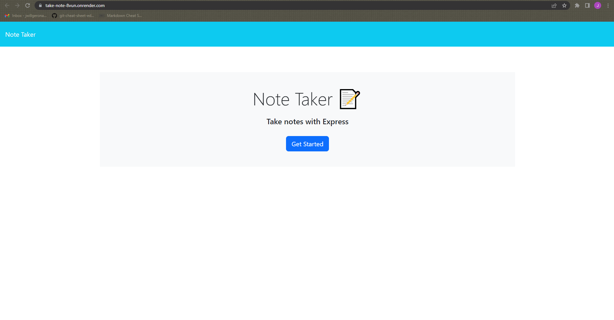
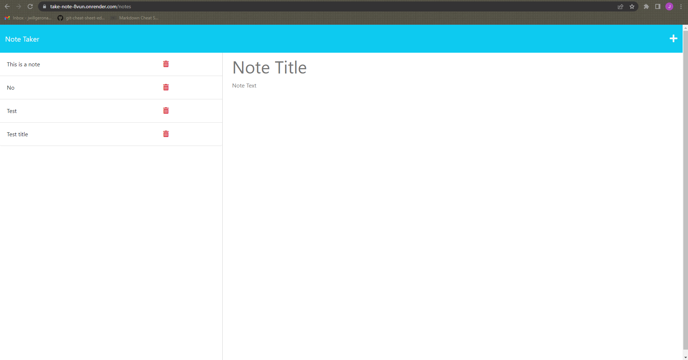

# <take-note>

## Description
An application that uses Express.js back end to store notes taken by the user and keep them on a json file for retrieval.

## Assets
The following images displays the applications's appearance:

You can use this [Link](https://take-note-8vun.onrender.com/) to access the page.